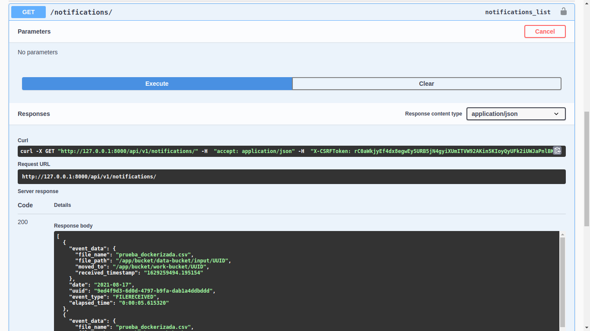

# Wise Athena API.

[](https://travis-ci.org/joemccann/dillinger)

 ## Inicio 🚀 
Wise Athena API. Es una RESTful API que tiene como principales funcionalidades: recibir ficheros csv y procesarlos, consultar una notificacion, listar notificaciones


## Tech

Wise Athena API usa varias tecnologías open source para que el proyecto funcione correctamente:

- [Python3]
- [Django3]
- [Django_rest_framework]
- [Docker]
- [Celery]
- [RabbitMQ]
- [drf-yasg]

## Pre requisitos

Wise Athena API requiere que tengas instalado Python3 y Composer.


## Desarrolladores

¿Quieres contribuir o probar? Genial!

Abre tu terminal favorita y escribe estos comandos.

Clona:

```sh
https://github.com/jblanquicett92/django_celery_app.git
```

o descarga y descomprime


Primer Tab:

```sh
docker build .
```

Segundo Tab
```sh
docker-compose up
```

## Documentación

Cuando el software ya se encuentre desplegado podrás ver la documentación swagger

```sh
http://127.0.0.1:8000/api/v1/doc/swagger/
```



## Endpoints

Sigue las instrucciones atentamente para poder consumir los servicios de los endpoints.


## receive_files
```sh
http://127.0.0.1:8000/api/v1/receive_file/
```


- POST: Enviamos al endpoint un request con el body en formato JSON

```sh
{
	"file_path":"/app/bucket/data-bucket/input/UUID",
	"file_name":"ex_001.csv"
}
```

En caso de que no existan errores, recibiremos el soguiente response


```sh
{
    "result": "File will be proccesed"
}

```
NOTA: Es importante que los archivos existan en las direcciones establecidas

## notifications
```sh
http://127.0.0.1:8000/api/v1/notifications/
```


- GET: Recibe un listado de todas las notificaciones realizadas por la app

```sh
[
     {
        "event_data": {
            "file_name": "ex_002.csv",
            "file_path": "/app/bucket/data-bucket/input/UUID",
            "moved_to": "/app/bucket/work-bucket/UUID",
            "received_timestamp": "1629266353.3990886"
        },
        "date": "2021-08-18",
        "uuid": "5e7bd57c-abf4-4ca9-a7b9-59ff277caff8",
        "event_type": "FILERECEIVED",
        "elapsed_time": "0:00:00.261005"
    },
    {
        "event_data": {
            "file_name": "ex_002.csv",
            "file_path": "/app/bucket/work-bucket/UUID",
            "moved_to": "",
            "received_timestamp": "1629266354.2102973"
        },
        "date": "2021-08-18",
        "uuid": "5e7bd57c-abf4-4ca9-a7b9-59ff277caff8",
        "event_type": "FILEERRORED",
        "elapsed_time": "0:00:00.261005"
    }
]
```

## notification
```sh
http://127.0.0.1:8000/api/v1/notification/<uuid>
```


- GET: Recibe notificacion filtrada por uuid

```sh
[
     {
        "event_data": {
            "file_name": "ex_002.csv",
            "file_path": "/app/bucket/data-bucket/input/UUID",
            "moved_to": "/app/bucket/work-bucket/UUID",
            "received_timestamp": "1629266353.3990886"
        },
        "date": "2021-08-18",
        "uuid": "5e7bd57c-abf4-4ca9-a7b9-59ff277caff8",
        "event_type": "FILERECEIVED",
        "elapsed_time": "0:00:00.261005"
    },
    {
        "event_data": {
            "file_name": "ex_002.csv",
            "file_path": "/app/bucket/work-bucket/UUID",
            "moved_to": "",
            "received_timestamp": "1629266354.2102973"
        },
        "date": "2021-08-18",
        "uuid": "5e7bd57c-abf4-4ca9-a7b9-59ff277caff8",
        "event_type": "FILEERRORED",
        "elapsed_time": "0:00:00.261005"
    }
]
```


## Flujo de procesamiento de archivos


1. El fichero se encuentra en la direccion: /app/bucket/data-bucket/input/UUID


2. El fichero es movido hacia otro directorio: /app/bucket/work-bucket/UUID


3. El fichero ahora esta en: /app/bucket/work-bucket/UUID


4. El fichero en caso de poder ser procesado pasa a : /app/bucket/procesed-data/UUID


5. La app genera de manera automatica un documento txt con metadatos del procesamiento en la ruta : /app/bucket/metadata/UUID


Al abrirlo, se puede observar los detalles del procesamiento

## UI consulta de Notificaciones por UUID
```sh
http://127.0.0.1:8000/uuid/
```


Registrar uuid en campo search


Presionar search UUID


MIT